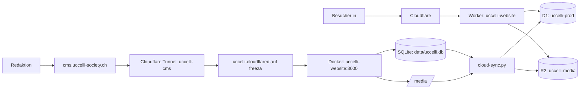
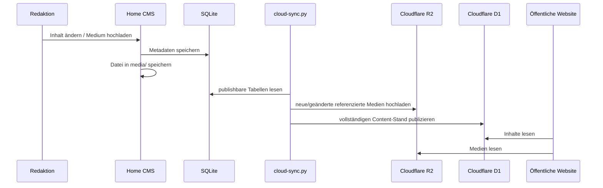

# Uccelli Website – Architektur

> **Stand:** 23. September 2026  
> **Status:** Produktionsarchitektur  
> **Geltungsbereich:** Öffentliche Website, Payload CMS, Cloudflare-Infrastruktur, Home-Server, Daten- und Medien-Synchronisation, Deployment und Betrieb.

Dieses Dokument beschreibt die **aktuelle Ziel- und Produktionsarchitektur** der Uccelli-Website. Es ist die technische Referenz für neue Entwickler:innen und für den Betrieb. Ältere Dokumente im Repository können noch historische Hostnamen oder frühere Deployment-Varianten enthalten; bei Widersprüchen gilt dieses Dokument für die Architektur.

---

## 1. Architektur in einem Satz

Die öffentliche Website läuft auf **Cloudflare Workers** mit **D1** und **R2**, während der redaktionelle **Payload-Admin** auf dem Home-Server `freeza` mit **SQLite** und lokalem Medienverzeichnis läuft; ein automatischer Publisher synchronisiert redaktionelle Inhalte und Medien vom Home-Server nach Cloudflare.

---

## 2. Gesamtübersicht



Die Architektur trennt bewusst **öffentliche Auslieferung** und **Redaktionssystem**:

- Die öffentliche Website bleibt verfügbar, auch wenn `freeza` oder der CMS-Tunnel offline ist.
- Redakteur:innen arbeiten ausschließlich im Home-CMS.
- Cloudflare erhält eine veröffentlichte Kopie der redaktionellen Inhalte.
- Besucherzugriffe belasten den Home-Server nicht.

---

## 3. Öffentliche Domains und Zuständigkeiten

| Hostname | Zweck | Ziel |
|---|---|---|
| `https://uccelli-society.ch` | Öffentliche Website | Cloudflare Worker `uccelli-website` |
| `https://www.uccelli-society.ch` | Canonical Redirect | 301 auf `https://uccelli-society.ch` |
| `https://cms.uccelli-society.ch` | Payload Admin | eigener Cloudflare Tunnel `uccelli-cms` → `freeza` |
| `/admin` auf der Hauptdomain | Komfort-URL | Redirect auf `https://cms.uccelli-society.ch/admin` |

Die DNS-Zone von `uccelli-society.ch` wird von Cloudflare verwaltet. Mail bleibt davon getrennt und wird weiterhin über die bestehenden Hosttech-MX-Einträge zugestellt.

Der frühere temporäre Host `uccelli.qrwed.uk` gehört **nicht** mehr zur Uccelli-Architektur und darf nicht als Abhängigkeit für das CMS verwendet werden.

---

## 4. Technologie-Stack

### Anwendung

- **Next.js 16.3.3**, App Router
- **React 19.2.6**
- **TypeScript**
- **Payload CMS 3.90.0**
- **next-intl** für UI-Routing und Übersetzungen
- **Payload Localization** für lokalisierte CMS-Felder
- **Tailwind CSS v4**
- **Framer Motion / GSAP** für Animationen

### Cloudflare

- **Cloudflare Workers** für die öffentliche Next.js-Anwendung
- **OpenNext for Cloudflare** als Adapter
- **Cloudflare D1** als öffentliche Produktionsdatenbank
- **Cloudflare R2** für öffentliche Medien
- **Cloudflare Tunnel** für den privaten Ursprung des Home-CMS
- **Cloudflare Turnstile** optional für Formular-Bot-Schutz

### Home-Server

- Hostname: `freeza`
- Docker / Docker Compose
- Payload Admin in Container `uccelli-website`
- SQLite als redaktionelle Datenbank
- lokales `media/`-Verzeichnis als redaktioneller Medienbestand
- systemd Timer für die Cloudflare-Publikation

### Externe Dienste

- **Resend** für Benachrichtigungen aus Kontaktformularen
- **Hosttech** für die bestehende Mail-Infrastruktur
- **GitHub** als Source Repository und CI-Auslöser

---

## 5. Zwei Payload-Konfigurationen

Das Repository verwendet absichtlich zwei Payload-Konfigurationen für zwei unterschiedliche Laufzeitumgebungen.

### `payload.config.ts` – Cloudflare Runtime

Diese Konfiguration ist für die öffentliche Website bestimmt.

- Datenbankadapter: `@payloadcms/db-d1-sqlite`
- Binding: `D1`
- Storage Plugin: `@payloadcms/storage-r2`
- Binding: `R2`
- Cloudflare-Kontext via `@opennextjs/cloudflare`
- produktionsgeeigneter strukturierter Logger

Die Cloudflare-Instanz ist primär ein **Read-/Public-Runtime-System**. Öffentliche Formulare können jedoch gezielt Daten direkt in D1 schreiben.

### `payload.config.home.ts` – Home-CMS Runtime

Diese Konfiguration wird beim Bau von `Dockerfile.admin` als `payload.config.ts` eingesetzt.

- Datenbankadapter: `@payloadcms/db-sqlite`
- Datenbank: `DATABASE_URI`, standardmäßig `file:./data/uccelli.db`
- keine D1- oder R2-Abhängigkeit
- lokaler Payload Upload Storage
- Fail-Fast, wenn im Produktionsbetrieb kein `PAYLOAD_SECRET` vorhanden ist

Damit bleibt das CMS vollständig lokal funktionsfähig und ist nicht von D1/R2 für redaktionelle Schreibvorgänge abhängig.

---

## 6. Datenhaltung und Source of Truth

### Redaktionelle Source of Truth

Für redaktionelle Inhalte ist die SQLite-Datenbank auf `freeza` die maßgebliche Quelle:

```text
/opt/uccelli-website/data/uccelli.db
```

Für hochgeladene Dateien ist das lokale Medienverzeichnis die redaktionelle Quelle:

```text
/opt/uccelli-website/media/
```

Redakteur:innen ändern Inhalte **nur im CMS unter `cms.uccelli-society.ch`**.

### Öffentliche Kopie

Die Website liest in Cloudflare aus:

```text
D1: uccelli-prod
R2: uccelli-media
```

Diese Daten werden regelmäßig vom Home-CMS veröffentlicht.

### Wichtig

Redaktionelle Content-Tabellen in D1 dürfen nicht als eigenständige zweite Pflegequelle behandelt werden. Der nächste Publisher-Lauf kann sie wieder durch den Stand aus SQLite ersetzen.

---

## 7. Datenmodell

Die Payload-Konfiguration enthält aktuell unter anderem folgende Collections:

- `projects`
- `community-items`
- `posts`
- `pages`
- `team-members`
- `partners`
- `faqs`
- `contact-submissions`
- `media`
- `events`
- `networks`
- `werte`
- `courses`
- `users`

Globals:

- `homepage`
- `navigation`

### Benutzer und Rollen

Payload `users` verwendet Authentifizierung und kennt aktuell die Rollen:

- `admin`
- `editor`

Die Benutzerverwaltung des Home-CMS ist lokal. Benutzer- und Sessiontabellen werden durch den Content-Publisher bewusst **nicht** von SQLite nach D1 gespiegelt.

---

## 8. Lokalisierung

Unterstützte Sprachen:

- `de` – Standard
- `en`

Routing:

```text
/                 Deutsch
/projekte         Deutsch
/en               Englisch
/en/projects/...  Englisch bzw. lokalisierte Route
```

Technisch:

- `next-intl` übernimmt Locale-Routing und UI-Texte.
- Payload speichert lokalisierte Content-Felder.
- Fehlende englische Inhalte fallen auf Deutsch zurück.
- Slugs sind grundsätzlich sprachunabhängig.

Canonical URLs und OpenGraph-URLs werden über `SITE_URL` erzeugt.

Produktionswert:

```env
SITE_URL=https://uccelli-society.ch
```

---

## 9. Öffentliche Website auf Cloudflare

### Worker

Wrangler-Konfiguration:

```text
Worker: uccelli-website
Main: .open-next/worker.js
Assets: .open-next/assets
```

### Bindings

```text
D1 binding: D1
Database: uccelli-prod

R2 binding: R2
Bucket: uccelli-media
```

Die Anwendung wird mit OpenNext für Cloudflare gebaut.

### Bilder

Next.js Image Optimization ist bewusst deaktiviert:

```ts
images: {
  unoptimized: true
}
```

Grund: Die OpenNext-Bildoptimierung würde eine zusätzliche Cloudflare-Images-Konfiguration benötigen. Payload-/R2-Bilder werden deshalb direkt ausgeliefert.

### Medienroute

Öffentliche Medien werden über folgende Route aus R2 gelesen:

```text
/api/media/file/[filename]
```

Die Route unterstützt `GET` und `HEAD`, übernimmt HTTP-Metadaten des R2-Objekts und setzt einen Cache-Control-Header.

---

## 10. Home-CMS auf `freeza`

### Docker Compose

Service:

```text
Compose service: uccelli
Container name: uccelli-website
Host port: 3100
Container port: 3000
Docker network: npm
```

Persistente Mounts:

```text
./data  -> /app/data
./media -> /app/media
```

Wichtige Environment-Variablen:

```env
DATABASE_URI=file:/app/data/uccelli.db
PAYLOAD_SECRET=...
SITE_URL=https://uccelli-society.ch
ADMIN_ORIGIN=https://cms.uccelli-society.ch
ADMIN_ONLY=1
```

### `ADMIN_ONLY=1`

Der Home-Container ist absichtlich ein CMS-Server, nicht die öffentliche Website.

- `/admin` bleibt erreichbar.
- andere Frontend-Routen werden zurück zu `/admin` geführt.
- die öffentliche Website wird ausschließlich von Cloudflare ausgeliefert.

### Build-Verhalten

`Dockerfile.admin`:

1. installiert Dependencies,
2. ersetzt `payload.config.ts` durch `payload.config.home.ts`,
3. entfernt die Cloudflare-spezifische R2-Passthrough-Route,
4. baut Next.js,
5. startet als User `node`,
6. prüft beim Start das lokale Schema,
7. startet den Next.js-Server.

### Healthcheck

Der Container prüft:

```text
GET /api/health
```

Der Healthcheck zählt testweise `pages` über die Payload Local API. Bei einem Datenbankfehler liefert er HTTP 503.

---

## 11. Cloudflare Tunnel für das CMS

Das CMS verwendet einen **eigenen Uccelli-Tunnel** und ist nicht an andere Projekte oder Domains gekoppelt.

```text
Tunnel name: uccelli-cms
Public hostname: cms.uccelli-society.ch
Service: http://uccelli-website:3000
```

Auf `freeza` läuft dafür ein separater Connector:

```text
Container: uccelli-cloudflared
Docker network: npm
```

Damit kann `cloudflared` den CMS-Container direkt über den Docker-DNS-Namen `uccelli-website` erreichen.

Der Tunnel wird remote über Cloudflare One verwaltet. Das Connector-Token gehört **nicht** ins Git-Repository.

Lokaler Token-Speicher auf `freeza`:

```text
/opt/uccelli-cloudflared/tunnel-token
```

Der Tunnel benötigt keine öffentlich erreichbare eingehende Portfreigabe zum Home-Server; `cloudflared` baut die Verbindung ausgehend zu Cloudflare auf.

---

## 12. `/admin`-Routing

`middleware.ts` trennt öffentliche Website und CMS.

### Auf der öffentlichen Website

```text
https://uccelli-society.ch/admin
```

wird auf

```text
https://cms.uccelli-society.ch/admin
```

umgeleitet.

### Im Home-CMS

Mit `ADMIN_ONLY=1` darf `/admin` lokal verarbeitet werden. Normale Frontend-Routen werden dort nicht als zweite öffentliche Website betrieben.

Default für den Admin-Ursprung:

```text
https://cms.uccelli-society.ch
```

---

## 13. Content-Publishing: SQLite → D1 und Media → R2

Publisher:

```text
scripts/cloud-sync.py
```

### Ablauf



### Synchronisierte Content-Bereiche

Der Publisher berücksichtigt Tabellen, die zu folgenden Roots gehören:

```text
media
projects
posts
events
team_members
partners
faqs
networks
werte
courses
pages
community_items
homepage
navigation
```

### Bewusst NICHT synchronisiert

- `users` und zugehörige Tabellen
- `contact_submissions` und zugehörige Tabellen
- `payload_*` interne Tabellen
- SQLite-Systemtabellen

Das ist eine zentrale Architekturregel: Cloud-only Runtime-Daten dürfen nicht durch einen Redaktions-Sync gelöscht werden.

### D1-Publikationsmodell

Für veröffentlichte Content-Tabellen wird ein vollständiger SQL-Snapshot erzeugt:

1. bestehende Zeilen der ausgewählten Tabellen löschen,
2. Zeilen aus SQLite in deterministischer Reihenfolge neu einfügen,
3. `PRAGMA optimize` ausführen.

Ein SHA-256-Hash des erzeugten SQL-Standes verhindert unnötige D1-Schreibvorgänge.

### Medien-Sync

- Es werden nur Dateien hochgeladen, die in der Payload-`media`-Tabelle referenziert sind.
- MIME-Type kommt bevorzugt aus der Datenbank.
- Änderungen werden anhand `size + mtime` erkannt.
- Der Publisher lädt neue/geänderte Dateien nach R2.
- Er löscht aktuell **keine verwaisten R2-Objekte** automatisch.

### Parallelität

Ein File Lock verhindert mehrere gleichzeitige Publisher-Läufe.

State-Datei standardmäßig:

```text
/var/lib/uccelli-cloud-sync/state.json
```

---

## 14. Automatischer Sync

systemd Units:

```text
ops/systemd/uccelli-cloud-sync.service
ops/systemd/uccelli-cloud-sync.timer
```

Produktiver Timer:

```text
OnBootSec=2min
OnUnitActiveSec=2min
RandomizedDelaySec=15s
Persistent=true
```

Das bedeutet: Änderungen werden typischerweise innerhalb weniger Minuten nach Cloudflare publiziert.

Der API-Token liegt außerhalb des Repositories in:

```text
/etc/uccelli-cloud-sync.env
```

Erforderliche bzw. relevante Variablen:

```env
CLOUDFLARE_API_TOKEN=...
UCCELLI_D1_DATABASE=uccelli-prod
UCCELLI_R2_BUCKET=uccelli-media
UCCELLI_DB_PATH=/opt/uccelli-website/data/uccelli.db
UCCELLI_MEDIA_DIR=/opt/uccelli-website/media
UCCELLI_SYNC_STATE=/var/lib/uccelli-cloud-sync/state.json
```

Der Token sollte nur die Rechte erhalten, die D1- und R2-Synchronisation tatsächlich benötigt.

---

## 15. Kontaktformular und Cloud-only Daten

`POST /api/contact` läuft auf der öffentlichen Cloudflare-Anwendung.

Ablauf:

1. Request validieren (`zod`).
2. einfaches IP-basiertes Rate-Limit prüfen.
3. falls konfiguriert: Cloudflare Turnstile verifizieren.
4. Submission direkt in D1 als `contact-submissions` speichern.
5. falls `RESEND_API_KEY` gesetzt ist: Benachrichtigungs-E-Mail via Resend senden.
6. E-Mail-Status (`pending`, `sent`, `failed`, `skipped`) in D1 aktualisieren.

Diese Submissions werden vom Home-CMS-Sync **nicht überschrieben**.

### Rate-Limit-Hinweis

Das aktuelle Rate-Limit verwendet eine In-Memory-Map im Runtime-Prozess. Auf einer serverlosen Worker-Architektur ist das ein **Best-Effort-Limit**, kein global konsistenter verteilter Rate-Limiter. Für stärkeren Missbrauchsschutz sind Turnstile und gegebenenfalls ein Cloudflare-seitiges Rate-Limit die robusteren Grenzen.

---

## 16. Environment-Variablen

### Anwendung / CMS

| Variable | Zweck |
|---|---|
| `PAYLOAD_SECRET` | Payload Auth/JWT Secret; geheim, niemals committen |
| `SITE_URL` | Canonical Origin der öffentlichen Website |
| `ADMIN_ORIGIN` | Origin des Home-CMS |
| `DATABASE_URI` | SQLite-Verbindung für das Home-CMS |
| `ADMIN_ONLY` | Home-Container als reines CMS betreiben |
| `RESEND_API_KEY` | E-Mail-Versand über Resend |
| `TURNSTILE_SITE_KEY` | Turnstile Frontend-Key |
| `TURNSTILE_SECRET_KEY` | Turnstile Server-Key |

### Publisher

| Variable | Zweck |
|---|---|
| `CLOUDFLARE_API_TOKEN` | Zugriff für D1/R2-Publisher |
| `UCCELLI_D1_DATABASE` | D1-Datenbankname |
| `UCCELLI_R2_BUCKET` | R2-Bucketname |
| `UCCELLI_DB_PATH` | Pfad zur lokalen SQLite-DB |
| `UCCELLI_MEDIA_DIR` | Pfad zum lokalen Medienverzeichnis |
| `UCCELLI_SYNC_STATE` | State-/Hash-Datei des Publishers |
| `UCCELLI_WRANGLER` | optional fixierte Wrangler-Version |

### Regel

Secrets gehören niemals in Git, Dockerfiles oder öffentliche Dokumentation mit echten Werten.

---

## 17. Repository-Struktur

Wichtige Verzeichnisse und Dateien:

```text
app/                         Next.js App Router
app/(payload)/               Payload Admin/API Integration
app/api/                     eigene öffentliche API-Routen
collections/                 Payload Collections
globals/                     Payload Globals
components/                  UI-Komponenten
lib/                         gemeinsame Runtime-Logik
messages/                    UI-i18n Texte
migrations/                  Payload/D1 Schemamigrationen
scripts/                     Content-, Schema- und Sync-Skripte
ops/systemd/                 Publisher systemd Units
public/                      statische Assets und Tools
docs/                        technische und Produktdokumentation

payload.config.ts            Cloudflare/D1/R2 Payload-Konfiguration
payload.config.home.ts       Home/SQLite Payload-Konfiguration
Dockerfile.admin             dediziertes Home-CMS Image
docker-compose.yml           Home-CMS Runtime
wrangler.jsonc               Cloudflare Worker + Bindings
open-next.config.ts          OpenNext Cloudflare-Konfiguration
middleware.ts                i18n + Admin-Routing
next.config.ts               Next.js-Konfiguration und Legacy-Redirects
```

---

## 18. Entwicklung lokal

Node-Version:

```text
>= 22.23.2 < 23
```

Typischer Ablauf:

```bash
cp .env.example .env
npm install
npm run dev
```

Weitere wichtige Befehle:

```bash
npm run lint
npm run typecheck
npm test
npm run build
npm run generate:types
npm run migrate
npm run migrate:create
npm run cloudflare:build
npm run preview
npm run sync:cloudflare
```

Lokale Entwicklung und Cloudflare-Entwicklung können unterschiedliche Bindings benötigen. `payload.config.ts` kann über Wrangler an Cloudflare-Bindings gelangen; der Home-CMS-Build verwendet dagegen explizit `payload.config.home.ts`.

---

## 19. Schemaänderungen

Änderungen an Payload Collections oder Globals müssen sowohl die lokale CMS-Seite als auch D1 berücksichtigen.

Empfohlener Ablauf:

```text
Collection/Global ändern
→ Payload Types neu erzeugen
→ Migration erzeugen
→ Migration testen
→ Commit + CI
→ Cloudflare Migration anwenden
→ Home-CMS mit kompatiblem Schema neu bauen/starten
```

Relevante Befehle:

```bash
npm run generate:types
npm run migrate:create
npm run cloudflare:migrate
```

Wichtig: SQLite und D1 sollen fachlich dasselbe Content-Schema besitzen, obwohl sie über unterschiedliche Adapter betrieben werden.

---

## 20. Deployment

### Öffentliche Website

Produktionscode liegt auf Branch `main`.

Cloudflare ist mit GitHub verbunden und deployt die öffentliche Website aus dem Repository. Das Build-Artefakt wird mit OpenNext erzeugt.

Für manuelles Deployment existiert:

```bash
npm run deploy
```

Dieser Scriptpfad führt zuerst die Cloudflare-Migrationen aus, baut danach OpenNext und deployt anschließend den Worker.

### Home-CMS

Auf `freeza`:

```bash
cd /opt/uccelli-website
git pull --ff-only origin main
docker compose up -d --build uccelli
docker compose ps
```

Der Home-CMS-Container wird nicht benötigt, um die bereits publizierte öffentliche Website auszuliefern.

---

## 21. CI / Qualitätskontrolle

GitHub Actions Workflow:

```text
.github/workflows/ci.yml
```

Aktuell werden unter anderem geprüft:

- Payload Types generieren
- CV-Creator JavaScript Syntax
- ESLint
- TypeScript
- Unit Tests mit Vitest
- externer CV-Compiler Smoke Test
- Cloudflare/OpenNext Produktionsbundle

Zusätzliche Smoke-Workflows können externe Funktionen separat prüfen.

---

## 22. Sicherheitsgrenzen

### Secrets

Nicht committen:

- `PAYLOAD_SECRET`
- Cloudflare API Tokens
- Tunnel Tokens
- Resend API Keys
- Turnstile Secret Keys
- `.env`
- produktive SQLite-Dateien

### Admin

- Admin ist nur über `cms.uccelli-society.ch` vorgesehen.
- Payload Auth bleibt die Anwendungsauthentifizierung.
- Der Cloudflare Tunnel veröffentlicht nur den benötigten CMS-Origin.
- Der Home-Server braucht für den Tunnel keine öffentliche eingehende Web-Portfreigabe.

### Git

`data/`, `media/`, Datenbanken und Backups dürfen nicht versioniert werden. Historische Repository-Versionen enthielten früher lokale Datenbankdateien; aktuelle Secrets und Admin-Passwörter dürfen deshalb nie aus alten Werten wiederverwendet werden.

---

## 23. Backups und Disaster Recovery

Backups sind eine **Betriebsanforderung außerhalb der Cloudflare-Synchronisation**.

Der Publisher nach D1/R2 ist kein vollständiger Ersatz für ein Backup, weil er primär einen aktuellen Veröffentlichungsstand repliziert.

Mindestens sichern:

```text
/opt/uccelli-website/data/uccelli.db
/opt/uccelli-website/media/
/opt/uccelli-website/.env bzw. Secrets separat und sicher
/etc/uccelli-cloud-sync.env separat und sicher
```

Empfehlungen:

- SQLite mit `.backup` sichern, nicht blind während Schreibvorgängen kopieren.
- Medien zusammen mit der DB sichern.
- mindestens eine Offsite-Kopie führen.
- Wiederherstellung regelmäßig testen.
- Tunnel- und Cloudflare-Tokens nicht in normale unverschlüsselte Projektbackups legen.

R2 und D1 erhöhen die Verfügbarkeit der öffentlichen Kopie, ersetzen aber nicht die redaktionelle Source-of-Truth-Sicherung.

---

## 24. Ausfallverhalten

| Ausfall | Auswirkung |
|---|---|
| `freeza` offline | Öffentliche Website bleibt grundsätzlich verfügbar; CMS und neue Publikationen fallen aus |
| CMS-Tunnel offline | CMS nicht erreichbar; öffentliche Website bleibt verfügbar |
| systemd Sync gestoppt | Website zeigt letzten erfolgreich publizierten Stand |
| D1 nicht erreichbar | dynamische öffentliche Inhalte/API können fehlschlagen |
| R2 nicht erreichbar | Medien können fehlen, Seitenstruktur kann weiterhin geladen werden |
| Cloudflare Worker gestört | öffentliche Website betroffen |
| Resend gestört | Kontaktanfrage kann weiterhin in D1 gespeichert werden; E-Mail-Status wird als Fehler markiert |
| Turnstile gestört und Secret aktiv | Formulare können mit Bot-Verifikationsfehler antworten |

Diese Entkopplung ist der Hauptgrund für die Hybridarchitektur.

---

## 25. Monitoring und Diagnose

### Home-CMS

```bash
docker compose ps
docker logs --tail 100 uccelli-website
curl -I https://cms.uccelli-society.ch/admin
```

### Tunnel

```bash
docker ps | grep uccelli-cloudflared
docker logs --tail 100 uccelli-cloudflared
```

### Publisher

```bash
systemctl status uccelli-cloud-sync.timer
systemctl status uccelli-cloud-sync.service
journalctl -u uccelli-cloud-sync.service -n 100 --no-pager
```

### Öffentliche Website

```bash
curl -I https://uccelli-society.ch
curl -I https://uccelli-society.ch/admin
```

Der erwartete `/admin`-Pfad auf der Hauptdomain ist ein Redirect zum CMS.

---

## 26. Architekturregeln für zukünftige Änderungen

1. **Keine direkte öffentliche Abhängigkeit vom Home-Server einführen.** Besuchertraffic soll auf Cloudflare bleiben.
2. **Redaktionelle Änderungen im Home-CMS durchführen.** D1 ist für diese Inhalte eine Publikationskopie.
3. **Cloud-only Daten vom Publisher ausschließen.** Insbesondere Kontaktanfragen dürfen nicht durch den Content-Sync überschrieben werden.
4. **Neue CMS-Medien müssen über die Payload-Mediathek laufen.** Nur DB-referenzierte Medien werden zuverlässig publiziert.
5. **Schemaänderungen in beiden Laufzeiten testen.** D1 und SQLite verwenden unterschiedliche Adapter.
6. **Secrets außerhalb von Git halten.** Das gilt auch für Tunnel-Tokens und Cloudflare-API-Tokens.
7. **`cms.uccelli-society.ch` bleibt der einzige offizielle Admin-Origin.** Keine Kopplung an fremde Cloudflare-Zonen oder andere Projekte.
8. **Produktionsdomain für SEO nicht auf Preview-/CMS-Hosts ändern.** `SITE_URL` bleibt `https://uccelli-society.ch`.
9. **Bei neuen Runtime-Daten festlegen, wem sie gehören.** Vor der Implementierung entscheiden: Home Source of Truth, Cloud-only oder synchronisiert.
10. **Backups getrennt von Publishing behandeln.** Synchronisation ist kein Backupverfahren.

---

## 27. Aktueller Zielzustand

```text
                           INTERNET
                               │
                    ┌──────────┴──────────┐
                    │                     │
        uccelli-society.ch      cms.uccelli-society.ch
                    │                     │
             Cloudflare Worker      Cloudflare Tunnel
                    │                     │
          ┌─────────┴─────────┐           │
          │                   │           ▼
      D1 uccelli-prod     R2 uccelli-media     freeza
          ▲                   ▲           │
          │                   │     uccelli-cloudflared
          └──────────┬────────┘           │
                     │                    ▼
              cloud-sync.py        uccelli-website:3000
                     ▲                    │
                     │             ┌──────┴──────┐
                     │             │             │
                  SQLite         SQLite        media/
              redaktionelle      CMS DB         Dateien
              Source of Truth
```

Kurz gesagt:

- **Cloudflare ist die öffentliche Runtime.**
- **`freeza` ist das Redaktionssystem.**
- **SQLite + lokales Media sind die redaktionelle Quelle.**
- **D1 + R2 sind die veröffentlichte Cloud-Kopie.**
- **Der Publisher verbindet beide Welten.**
- **Der CMS-Tunnel ist ein eigener Uccelli-Tunnel.**

Damit bleibt die Website schnell und hoch verfügbar, während Payload ohne die CPU- und Runtime-Grenzen des Cloudflare-Free-Plans auf dem Home-Server betrieben werden kann.
